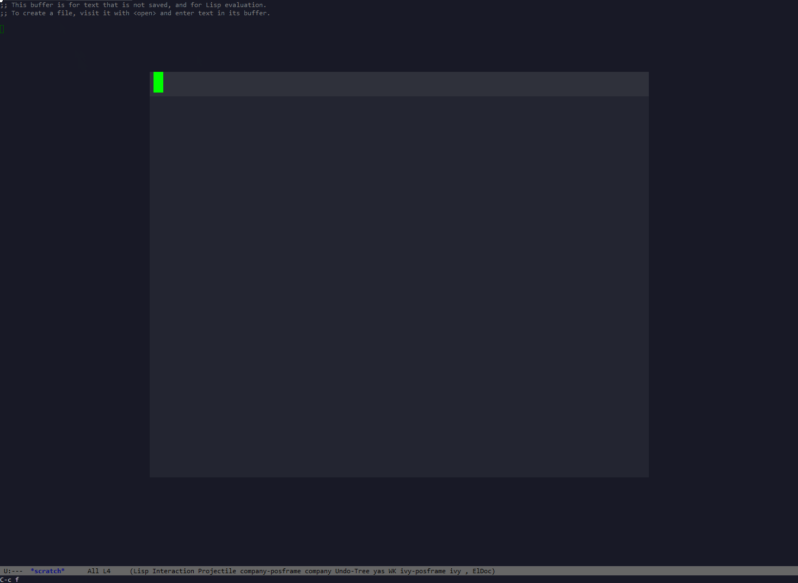

# snails-backend-searchablepdf.el

Not useable, after 2019-07-23 16:41:05. Just for demo.

To much pain with pdf making it impossible for a durable package.

I find someone did this: https://github.com/manateelazycat/snails/pull/61

I did not play with myself, but might be a good starting point.
